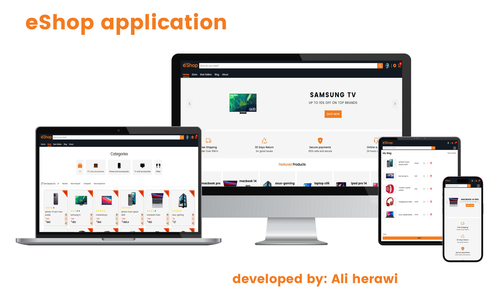
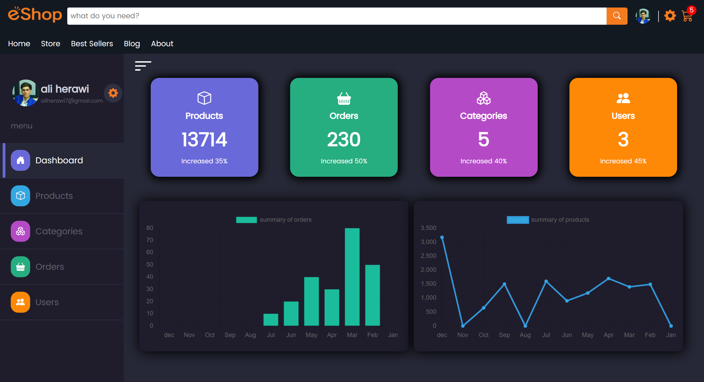
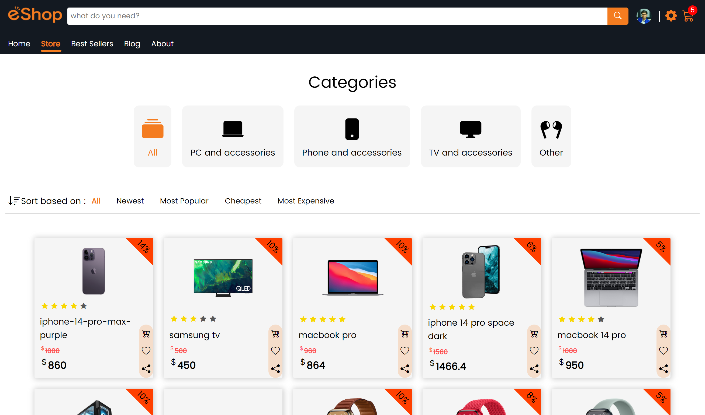

# eshop-store
<!-- creator: Ali Herawi -->
<!-- github: https://github.com/Aliherawi7 -->
<!-- Email: Aliherawi7@gmail.com -->
<!-- Linked in : https://linkedin.com/in/ali-herawi -->

eshop-store was created and developed with **React (v17.0.2)**, **JavaScript** ,
**react-chartjs-2 (v4.3.1)**, **react-toastify (v9.0.8)** and **React Router v6**. For Styles and animations, is used **CSS**.

# Demo

Visit: [Project eshop demo](https://eshop-demo.netlify.app/)

# Features

* Responsive layout
* React Hooks
* React Toastify
* React Context
* Custome Slider
* React Router v6
* React-Chartjs
* Bootstrap icon

# Pages

* home
* Store
* Search
* admin panel
* account setting
* favorite products
* Basket
* Login
* Signup
* Product info
* 404 Error(not found)

# Getting Started

**1. Clone from Github**

`git clone https://github.com/Aliherawi7/eshop-store.git`

**2. Run `npm install` or `yarn install`**

This will install both run-time project dependencies and developer tools listed in package.json file.

**3. Run `npm start` or `yarn install`**

Runs the app in the development mode.

      
**4. Run `npm build` or `yarn build`**

Builds the app for production to the build folder. It correctly bundles React in production mode and optimizes the build for the best performance.

The build is minified and the filenames include the hashes. Your app is ready to be deployed!

# Would you mind support me?

* Star GitHub repo
* Create pull requests, submit bugs, suggest new features or documentation updates.

